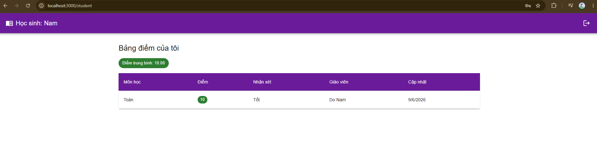
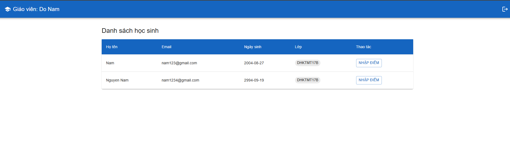
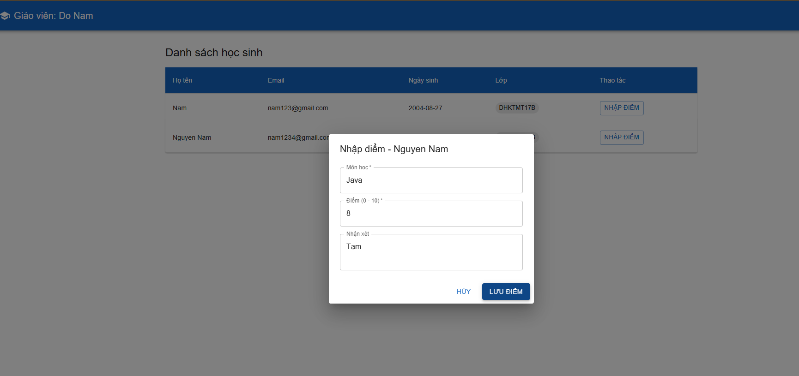

# Classroom Management System


## Tech Stack
- **Frontend**: ReactJS + Material UI + Redux Toolkit
- **Backend**: Spring Boot 3 (Java 17) + Spring Security + JWT
- **Database**: PostgreSQL (Docker)
- **Messaging**: Apache Kafka (email notification khi cập nhật điểm)
- **Logging**: Log4j2
- **CI/CD**: GitHub Actions → Docker Hub → VPS

---
## Screenshots

**Student - Bảng điểm**


**Teacher - Danh sách học sinh**


**Teacher - Nhập điểm**


## Quick Start

### 1. Clone & setup
```bash
git clone https://github.com/LucKyQN/classroom-management.git
cd classroom-management
cp .env.example .env
```

### 2. Chạy toàn bộ stack bằng Docker
```bash
docker compose up -d
```
- Frontend: http://localhost:3000
- Backend API: http://localhost:8080
- PostgreSQL: localhost:5432

### 3. Chạy local (dev mode)
```bash
# Terminal 1 - DB + Kafka
docker compose up postgres zookeeper kafka -d

# Terminal 2 - Backend
cd backend
mvn spring-boot:run

# Terminal 3 - Frontend
cd frontend
npm install --legacy-peer-deps
npm start
```

---

## Project Structure
```
classroom-management/
├── backend/
│   ├── src/main/java/com/classroom/
│   │   ├── config/          # SecurityConfig, KafkaConfig, DataInitializer
│   │   ├── controller/      # AuthController, TeacherController, StudentController
│   │   ├── dto/             # Request/Response DTOs
│   │   ├── entity/          # User, Classroom, Grade
│   │   ├── exception/       # GlobalExceptionHandler
│   │   ├── kafka/           # Producer, Consumer, Event
│   │   ├── repository/      # JPA Repositories
│   │   ├── security/        # JwtUtil, JwtAuthFilter, UserDetailsService
│   │   └── service/impl/    # AuthService, TeacherService, StudentService
│   └── src/main/resources/
│       ├── application.yml
│       └── log4j2.xml
├── frontend/
│   ├── src/
│   │   ├── components/common/  # ProtectedRoute
│   │   ├── pages/              # LoginPage, RegisterPage, TeacherPage, StudentPage
│   │   ├── services/api.js     # Axios + JWT interceptor
│   │   ├── store/              # Redux (authSlice)
│   │   └── App.jsx
│   └── Dockerfile
├── .github/workflows/deploy.yml
├── docker-compose.yml
└── .env.example
```

---

## API Endpoints

| Method | URL | Auth | Role |
|--------|-----|------|------|
| POST | /api/auth/register | ❌ | - |
| POST | /api/auth/login | ❌ | - |
| GET | /api/classrooms | ❌ | - |
| GET | /api/teacher/students | ✅ JWT | TEACHER |
| POST | /api/teacher/grades | ✅ JWT | TEACHER |
| GET | /api/student/grades | ✅ JWT | STUDENT |

---


## Security Features
- Password: BCrypt hashing (strength 10)
- Auth: JWT Bearer Token (24h expiry)
- Route protection: ProtectedRoute component (frontend) + Spring Security (backend)
- Role-based: `@PreAuthorize("hasRole('TEACHER')")` trên controller
- CORS: Configured, chỉ cho phép request hợp lệ

## Kafka Email Flow
1. Giáo viên POST `/api/teacher/grades`
2. `TeacherService` lưu điểm vào DB
3. `GradeNotificationProducer` publish event vào topic `grade-notifications`
4. `GradeNotificationConsumer` nhận event → gửi email qua JavaMailSender


## Docker Secrets (GitHub Actions)
Cần set trong GitHub Repo Settings → Secrets:
- `DOCKERHUB_USERNAME`, `DOCKERHUB_TOKEN`
- `VPS_HOST`, `VPS_USER`, `VPS_SSH_KEY`
- `MAIL_USERNAME`, `MAIL_PASSWORD`
